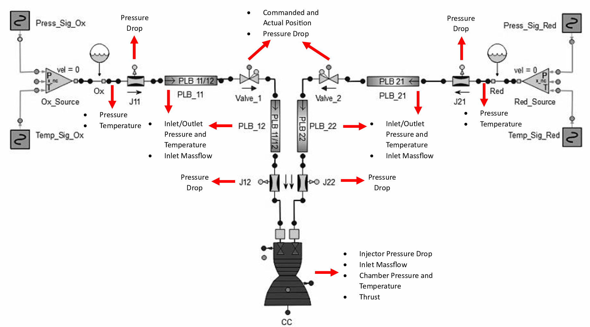

# Deep Learning for FDI in Rocketry

**Author:** Miguel Marques  
**Release Date:** June 2025

## Table of Contents
- [About The Project](#1-about-the-project)
- [Goals](#2-goals)
- [Performance and Goal Assessment](#3-performance-and-goal-assessment)
- [Built With](#4-built-with)
- [Simulations Framework](#5-simulations-framework)
  - [EcosimPro Model](#51-ecosimpro-model)
  - [data_gen.py](#52-data_genpy)
- [Models](#6-models)
  - [Data Preprocessing](#61-data-preprocessing)
  - [Optuna Optimization](#62-optuna-optimization)
- [Installation and Usage](#7-installation-and-usage)
  - [Simulations](#71-simulations)
  - [Models](#72-models)
- [Future Work](#8-future-work)

## 1. About The Project

This project explores the use of deep learning for fault detection and identification (FDI) for a small hopper vehicle of TUM's chair of Space Mobility and Propulsion. Two models (an FNN and an LSTM) are trained on synthetic data from an EcosimPro digital twin.

This research was developed as part of a Master’s Thesis at the Technical University of Munich (TUM). The full thesis report is available [here](./Report/Msc_Thesis_Miguel_FDI_Final.pdf).

The project encompasses two main Python-based frameworks: 
- **Simulations:** Synthetic time-series data generation using an EcosimPro digital twin.
- **Models:** For model training and performance evaluation. Using an FNN and an LSTM.

Two neural network models, a feedforward neural network (FNN) and a long short-term memory (LSTM) are trained on the generated syntheti data. The FNN serves as a baseline model, whereas the LSTM was chosen for its recurrent architecture and gated memory mechanisms, allowing it to better capture dependencies in time-series data.

Dataset summary:
- 37 Features:
  - Thrust
  - Temperature
  - Pressure
  - Mass Flow
  - Valve Positions
- 63 Faults
  - 14 System:
    - Pipe Blockage
    - Pipe Leak
    - Pipe Blockage + Leak
    - Slow Valve
  - 48 Sensors:
    - Drift
    - Bias
    - Freeze

The complete workflow is depicted in the figure below:
<div align="center">
  
</div>

## 2. Goals

- **1. Validate the suitability of deep learning models for fault identification in rocketry:** Up until this research endeavor, machine learning applications in the context of rocketry were restricted to plain fault detection.
- **2. Achieve high fault identification accuracy with low latency:** With concrete performance goals of an F1 score > 0.9 and Identification Delay < 50 ms.
- **3. Confirm the expected better performance of the LSTM model**
- **4. Build a scalable and adaptable framework:** So that upon new iterations of the hopper the proposed 

## 3. Performance and Goal Assessment

As expected, the LSTM model superseded the FNN's performance.

The main takeaways for the LSTM performance are summarized below:
- Overall F1 Score: 0.8257
- Faults correctly identified in 91% of the simulation (959 in total)
- Best performing fault classes:
  - Pipe Blockage:
    - Precision: 0.996
    - Recall: 0.987
    - Ident. Delay: 30 ms
  - Sensor Drift:
    - Precision: 0.999
    - Recall: 0.989
    - Ident. Delay: 90 ms
- Best performing fault:
  - Sensor Drift in Oxidizer Tank Outlet Pressure reading: 100% Identification Accuracy.
- Worse performing fault classes:
  - Valve Faults:
    - Precision: 0.411
    - Recall: 0.131
    - Ident. Delay: 8 s
    - Reason: Due to ambiguous labelling, highlighting the importance of data quality and labelling.

## 4. Built With

-   
-   
- 

## 5. Simulations Framework

The *data_gen.py* consists of the main script in charge of streamlining the generation of hopper launch simulations based on its EcosimPro digital twin.

Each simulation is based on a randomly generated trajectory, with variability introduced by changing the maximum thrust, target height, and initial propellant mass.

### 5.1 EcosimPro Model

**"HFM_01_2"** model developed by Saravjit Singh:
<div align="center">
  
</div>

### 5.2 *data_gen.py*

Upon execution the user is presented a GUI to allow easy parameter selection:
<div align="center">
  
</div>

The default model and simulation time are predefined. For the current release only the "HFM_01_2" is available. The user can select the type of simulation, normal or, in the case of a fault, which class.

- **Number of Simulations:** User defined, to allow generation of batches of simulations.
- **Trajectory Print:** ON: Prints trajectory computation information to the console.
- **Thrust/Position Plots:** ON: Saves plots of thrust and position (height) over time, under the "Plots" directory.

The output consists of CSV files with one-hot label encoding, that are saved and organized in folders under the "Data" directory.

Below follows a figure illustrating the complete data generation framework:
<div align="center">
 
</div>

## 6. Models

Both the FNN and LSTM models follow a unified workflow to promote code reusability and ensure consistent comparison of results. 

The LSTM framework is outlined below. The FNN model shares the same structure, with the main differences located in the *FNN_main.py* and *FNN_settings.py* files, as opposed to *LSTM_main.py* and *LSTM_settings.py*.

<div align="center">
 
</div>

**Models:**

- **FNN:** 4 Fully-Connected layers with batch normalization, LeakyReLU activation and dropout.
- **LSTM:** Number of layers customizable within the model settings. Layer normalization, ReLU, dropout, optionally bidirectional.

**Packages:**
- **Headers_Pkg:** Scripts containing lists to define the features and labels os interest, as well as for manually setting class weights.
- **Custom_NN_Pkg:** Implements a custom loss function, *focal_loss.py*, as well as an early stopping logic to abort training as soon as performance has stabilized.
- **Aux_Pkg:** Utility scripts used for model evaluation, GPU configuration and data logging.

**Output:**

Under a folder *\<model\>_Trained_Models*, each trained model has a subfolder with a unique timestamp identification. Inside, both the best-performing model and the final model (from the last training epoch) can be found. Accompanying postprocessing scripts allow evaluation of the model under inference.


### 6.1 Data Preprocessing

The models operate on input data in *NPY* format, which significantly reduces both spatial and temporal complexity during training. Upon loading, the data is processed through the ***Preprocessing_Pkg***, which includes two key scripts.

- ***npy_processing.py*:** splits the dataset into training and validation subsets while computing global statistics. These include class distributions, imbalance metrics, and the mean and standard deviation used for normalization.

- ***sliding_window.py*:** segments the time-series data into fixed-length sequences, as defined in the corresponding *\<model>\_settings.py* file. These sequences are normalized using the previously computed statistics. (While caching all sliding windows would accelerate training, memory limitations prevent this, making on-the-fly preprocessing the only feasible approach.)

A key distinction between the FNN and LSTM models arises at this stage. For the LSTM, the sliding windows preserve the original 2D temporal structure of the data. In contrast, the FNN requires these sequences to be flattened into 1D vectors, which leads to a partial loss of temporal dependency information.

The diagram below illustrates the full preprocessing pipeline:
<div align="center">
 
</div>

### 6.2 Optuna Optimization

An Optuna-based hyperparameter optimization framework is provided for each model. It consists of two scripts:

- ***\<model\>_Optuna.py:*** The main script where the user defines the hyperparameters to be tuned and their respective search ranges.

- ***\<model\>_Optimization.py:*** A supporting script that provides a duplicate of the model's neural network architecture for use in the optimization process.

The optimization results are saved in the *<model>_Optimizations* folder.

## 7. Installation and Usage

### Setup

1. Clone the repository:

`git clone https://github.com/MBM42/Deep_Learning_FDI_Rocketry.git`


### 7.1 Simulations

#### Prerequisites

- Python 3.11+ 
- The current working directory must be "Simulations".
- The *data_gen.py* script must be executed within an Windows environment.

### 7.2 Models

#### Prerequisites - For Windows Users

- This project requires WSL2 (Windows Subsystem for Linux):
  1. Install WSL2: `wsl --install` (in PowerShell as Administrator)
  2. Install Ubuntu or your preferred Linux distribution
  3. Restart your computer
  4. Continue with installation steps below in your WSL terminal
- Python 3.10
- pip package manager

#### Prerequisites - For macOS/Linux Users

- Python 3.10
- pip package manager
- The current OS directory shall be the folder to which the repository is cloned to.

#### Install Dependencies

- `pip install -r requirements.txt`

#### Script Use Sequence

1. ***preprocess.py:*** To convert data from *csv* to *npy* format. Use *n_first_timestamps* to define fault clipping.
2. ***\<model\>_main.py:*** With the desired settings defined in the corresponding file.
3. ***\<model\>_inference.py:*** In the output folder, used for inference.

#### Example Run

An already preprocessed example dataset is provided under the *Data* folder. This allows to understand model training, the structure of the output and also how the inference script works.

The example debug dataset has no data categories (*\<model\>_settings.py*):
```
data_types: list = field(default_factory=lambda: ['.'])
```
This setting shall be modified depending on the dataset structure, such as:
``` 
data_types: list = field(default_factory=lambda: ['Normal', 'Valve', 'Block', 'Block_Leak', 'Sensor_Fault'])
```

## 8. Future Work

The next objective of this project is to develop a forecasting model based on an LSTM architecture, capable of anticipating the onset of a fault and subsequently identifying the specific fault type using a redline-based thresholding logic. Initial development efforts toward this goal have already begun, although the model has not yet been finalized.


<!---
NO LONGER NEEDED - Kept in ReadMe for future reference and debug purposes
## Installation
```
pip install PyQt5
import matplotlib
matplotlib.use('TkAgg')
sudo apt-get install python3-tk
```
-->
